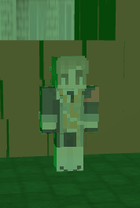
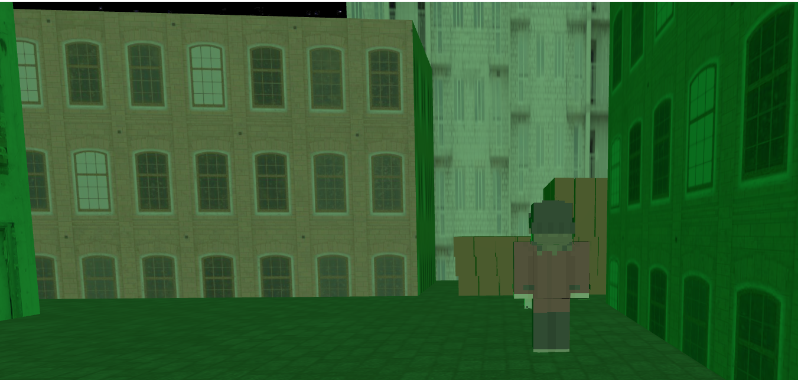
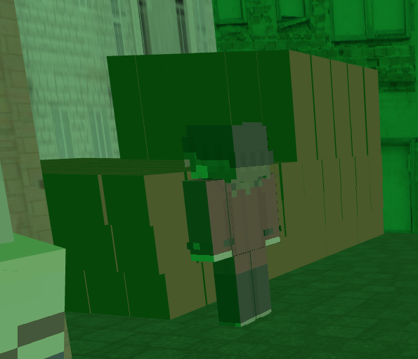
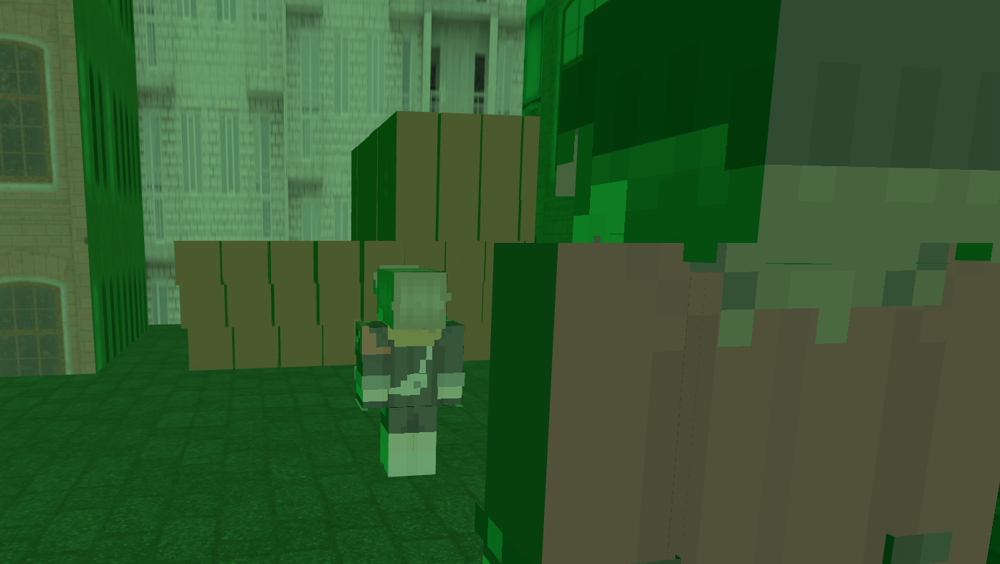
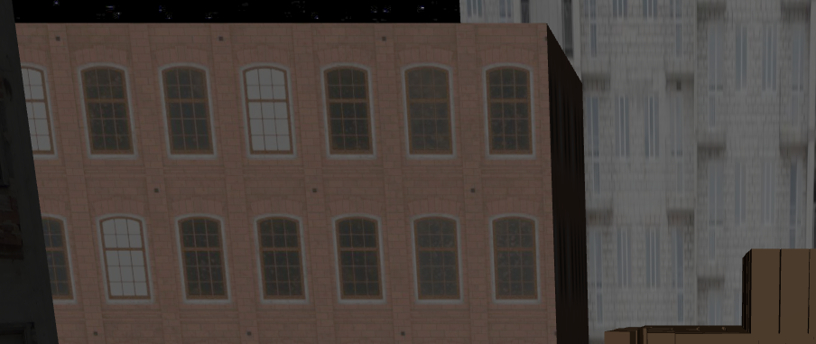

# IG25-26-S11-Animation

## Índice

- [Disclaimer](#disclaimer)
- [Tarea Propuesta](#tarea-propuesta)
- [Animación](#animación)
- [Implementación](#implementación)
  - [Modelos](#modelos)
  - [Escena](#escena)
  - [Ambiente](#ambiente)
  - [Físicas y Tween](#físicas-y-tween)
- [Enlace al código](#enlace-al-código)
- [Referencias](#referencias)

## Disclaimer

Este proyecto contiene referencias yo/ spoilers del videojuego Persona 3 Reload, se ruega discreción.

## Tarea Propuesta

Se nos presenta una propuesta de prototipo que implemente las librerías tween.js y/o el motor de física ammo.js. Para ello, se ha decidido realizar una animación con estética Minecraft que implementa tanto tweens (cambios de cámaras, posición de extremidades) y físicas (colisiones con edificios, cuerpo...).

## Animación

Esta animación, basada en una escena del conocido juego Persona 3 Reload, trata de recrear el momento en el que el SEES (Sociedad extraescolar de ejecución de sombras) sufre una pérdida en una de sus operaciones en la temida **Hora Oscura**. Durante esta hora el transcurso del tiempo en la realidad se paraliza y la luna se tiñe de verde, dando paso a las temibles sombras.

## Implementación

### Modelos

Para cargar los modelos, hemos hecho uso de la función playerObject() implementada en la librería [skinview3d](https://github.com/bs-community/skinview3d/tree/master). Para ello, hemos implementado una función **createCharacter()** para su correcta adición a la escena. Dicha función se encarga de recibir la posición, escala y textura del modelo que se desea añadir para posteriormente cargarlo en la escena.

```
function createCharacter(params) {
  const position = params.position || new THREE.Vector3(0, 0, 0);
  const scale = params.scale || new THREE.Vector3(0.125, 0.125, 0.125);
  const skinURL = params.skinURL || "assets/skin.png";

  const player = new PlayerObject();
  player.position.copy(position);
  player.scale.copy(scale);

  const loader = new THREE.TextureLoader();
  loader.load(skinURL, (texture) => {
    texture.magFilter = THREE.NearestFilter;
    texture.minFilter = THREE.NearestFilter;
    texture.flipY = true;
    player.skin.map = texture;
    player.cape.visible = false;
  });

  scene.add(player);

  return { player }; // Retornamos player para poder animar sus articulaciones
}
```



### Escena

Para crear un ambiente de callejón hemos creado edificios con físicas para evitar que los personajes los atraviesen, todo ello haciendo uso de una función **createCube()** a la que le hemos pasado además una textura cargada para que los cubos creados se asemejen aún más a edificios reales.

```
function createCube(options = {}) {
  const {
    position = new THREE.Vector3(0, 0, 0),
    size = new THREE.Vector3(1, 1, 1),
    color = 0xffffff,
    texture = null,
    rotation = null,
    castShadow = true,
    receiveShadow = true,
    physics = false,
    mass = 0,
  } = options;

  const geometry = new THREE.BoxGeometry(size.x, size.y, size.z);
  const material = new THREE.MeshPhongMaterial(
    texture ? { map: texture } : { color }
  );

  const mesh = new THREE.Mesh(geometry, material);

  mesh.position.copy(position);

  if (rotation) {
    if (rotation instanceof THREE.Euler) {
      mesh.rotation.copy(rotation);
    } else {
      mesh.rotation.set(rotation.x || 0, rotation.y || 0, rotation.z || 0);
    }
  }

  mesh.castShadow = castShadow;
  mesh.receiveShadow = receiveShadow;

  scene.add(mesh);

  // Si physics = true se activan las físicas para los edificios
  if (physics) {
    const shape = new Ammo.btBoxShape(
      new Ammo.btVector3(size.x / 2, size.y / 2, size.z / 2)
    );
    shape.setMargin(0.05);

    const transform = new Ammo.btTransform();
    transform.setIdentity();
    transform.setOrigin(new Ammo.btVector3(position.x, position.y, position.z));

    const quat = new THREE.Quaternion();
    mesh.getWorldQuaternion(quat);
    transform.setRotation(
      new Ammo.btQuaternion(quat.x, quat.y, quat.z, quat.w)
    );

    const motionState = new Ammo.btDefaultMotionState(transform);

    const localInertia = new Ammo.btVector3(0, 0, 0);
    if (mass > 0) shape.calculateLocalInertia(mass, localInertia);

    const rbInfo = new Ammo.btRigidBodyConstructionInfo(
      mass,
      motionState,
      shape,
      localInertia
    );

    const body = new Ammo.btRigidBody(rbInfo);
    body.setFriction(0.8);

    mesh.userData.physicsBody = body;

    physicsWorld.addRigidBody(body);
    if (mass > 0) rigidBodies.push(mesh);
  }

  return mesh;
}
```



De igual manera, hemos reutilizado la función **createWall()** para crear una nueva función **createBoxCluster()** para crear cúmulos de cajas con físicas al final del callejón.

```
function createBoxCluster({
  sizeX = 8, // Definimos cuantas cajas a lo ancho
  sizeY = 3, // Definimos cuantas cajas hacia arriba
  sizeZ = 5, // Definimos cuantas cajas de profundidad
  boxWidth = 1,
  boxHeight = 1,
  boxDepth = 1,
  mass = 1,
  origin = new THREE.Vector3(7, 0.5, 10.5),
  material = new THREE.MeshPhongMaterial({ color: 0xb08b68 }),
} = {}) {
  const pos = new THREE.Vector3();
  const quat = new THREE.Quaternion(0, 0, 0, 1);

  // Empezamos desde la esquina baja del bloque
  for (let y = 0; y < sizeY; y++) {
    for (let x = 0; x < sizeX; x++) {
      for (let z = 0; z < sizeZ; z++) {
        pos.set(
          origin.x + x * boxWidth,
          origin.y + y * boxHeight,
          origin.z + z * boxDepth
        );

        const box = createBoxWithPhysics(
          boxWidth,
          boxHeight,
          boxDepth,
          mass,
          pos,
          quat,
          material
        );

        box.castShadow = true;
        box.receiveShadow = true;
      }
    }
  }
}
```



### Ambiente

De primeras, observamos que la escena tiene una iluminación de ambiente de color verde: esto es totalmente intencional. Como hemos dicho anteriormente, durante la Hora Oscura la luna adopta un color verde que afecta directamente al ambiente, tal y como se puede ver en esta captura.


Para ello, hemos modificado la variable global ambientLight para que tome este color verde tan característico.

```
ambientLight = new THREE.AmbientLight(0x1ed643, 0.35);
scene.add(ambientLight);
```



Al finalizar la escena y una vez la tragedia se ha producido, la hora oscura llega a su fin, llevándose con ella el ambiente tenebroso, pero no el desconsuelo por el incidente acaecido.

```
ambientLight.color.set(0x707070); // Cambiamos el color del ambiente a blanco
ambientLight.intensity = 0.05; // Cambiamos la intensidad del mismo
```



### Físicas y Tween

Con el fin de poder animar la escena, se ha hecho uso de las librerías tween.js y ammo.js. Entre algunos de sus usos podemos destacar:

  - Añadido de físicas a los edificios: impide que los personajes se salgan de escena al chocar.
  - Añadido de físicas a los personajes: en este caso, solo se lo aplicamos a uno, pero esto le permite sufrir colisiones.
  - Añadido de tweens:
    - Movimiento de la cámara: para aportar fluidez al cambio de posición de la misma, como por ejemplo:

    
     
    - Movimiento de los personajes: haciendo uso de la función **animateWalkingDistance()** que implementa un Tween, permitimos ese movimiento fluido por la escena:

    

## Enlace al código

En el siguiente enlace puede acceder al código contenido en el repositorio de codesandbox: https://codesandbox.io/p/sandbox/dark-surf-jt58z7

## Referencias

- [Documentación](https://threejs.org/docs/index.html#Audio)
- [Documentación Tween](https://tweenjs.github.io/tween.js/docs/user_guide.html)
- [Librería skinview3d](https://github.com/bs-community/skinview3d/tree/master)
- ["[Minecraft] Pistol" by sedona1029 is licensed under Creative Commons Attribution](https://skfb.ly/6UXyr)
- [Texturas Minecraft](https://www.minecraftskins.com)
- [Guión de la práctica de Shaders](https://github.com/otsedom/otsedom.github.io/tree/main/IG/S11)

